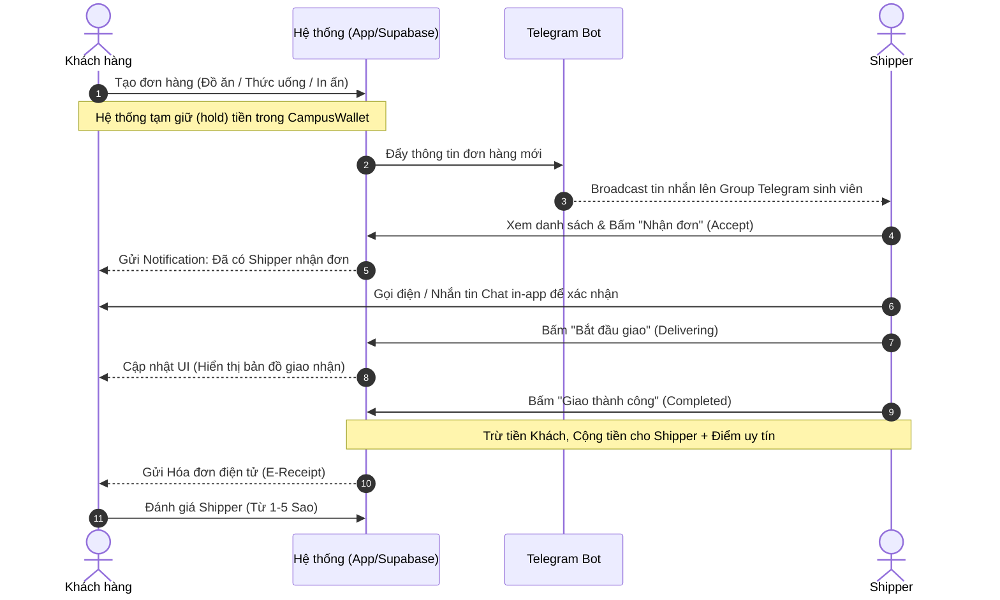
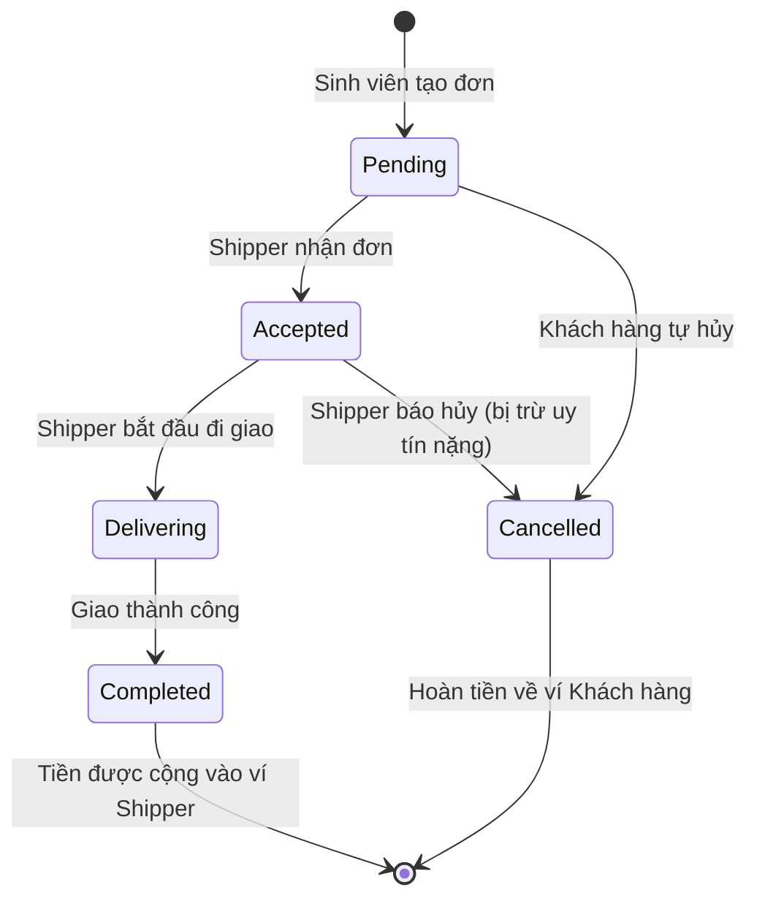
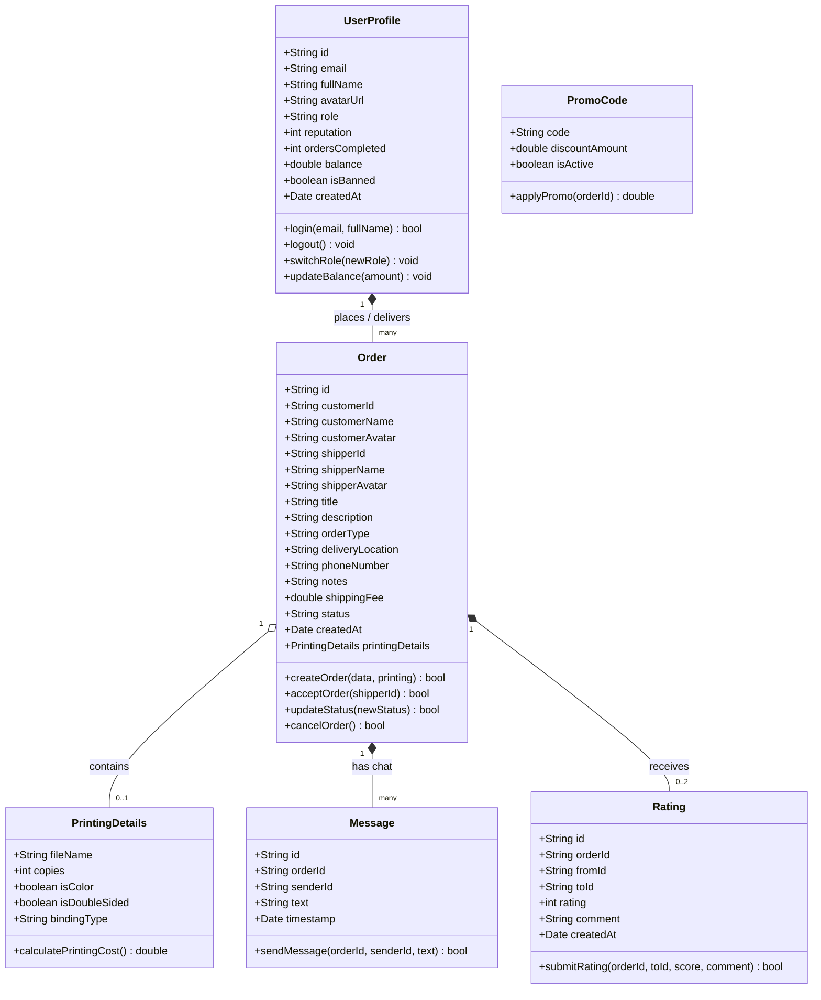

# ⚙️ SƠ ĐỒ VẬN HÀNH DỰ ÁN CAMPUS EXPRESS

Tài liệu này mô tả chi tiết luồng vận hành của hệ thống giao nhận nội khu Campus Express, giúp bạn và đội ngũ dễ dàng quản lý, cũng như có thể sử dụng trực tiếp để đưa vào slide thuyết trình (pitch deck).

## 1. Luồng Tương Tác Cốt Lõi (Core Flow)

Biểu đồ tuần tự dưới đây mô tả hành trình từ khi Khách hàng đặt đơn cho đến khi Shipper hoàn thành và nhận tiền.



---

## 2. Mô Hình Trạng Thái Đơn Hàng (Order State Machine)

Quá trình chuyển đổi trạng thái của một đơn hàng trong hệ thống.



---

## 3. Cấu Trúc Hệ Sinh Thái Ứng Dụng (Architecture)

```mermaid
graph TD
    subgraph Frontend (Next.js / React)
        UI[Giao diện Mobile-First]
        CD[Customer Dashboard]
        SD[Shipper Dashboard]
        AD[Admin Dashboard]
        UI --> CD
        UI --> SD
        UI --> AD
    end

    subgraph Backend & DB (Supabase / LocalStorage)
        Auth[Xác thực .edu email]
        DB[(PostgreSQL / Local State)]
        Wallet[CampusWallet Engine]
    end

    subgraph External Services
        Bot[Telegram Bot Dispatcher]
    end

    CD <-->|Lấy/Cập nhật| DB
    SD <-->|Lấy/Cập nhật| DB
    AD <-->|Quản lý| DB
    
    DB -->|Trigger Đơn Mới| Bot
    CD <--> Wallet
    SD <--> Wallet
```

---

## 4. Sơ đồ Lớp Đối Tượng (OOP Class Diagram)

Sơ đồ này mô hình hóa cấu trúc hướng đối tượng của hệ thống, chỉ rõ các thuộc tính (attributes), phương thức (methods) và mối quan hệ (relationships) giữa các thực thể cốt lõi trong phần mềm Campus Express.



*Giải thích mối quan hệ:*
- **UserProfile** và **Order** (Composition `*--`): Một UserProfile có thể đặt hoặc đi giao nhiều đơn hàng (Order).
- **Order** và **PrintingDetails** (Aggregation `o--`): Một đơn hàng có thể chứa 0 hoặc 1 chi tiết in ấn PDF (PrintingDetails).
- **Order** và **Message** (Composition `*--`): Một đơn hàng có một cuộc hội thoại nội bộ gồm nhiều tin nhắn (Message). Khi đơn hàng bị hủy/xoá hoàn toàn, tin nhắn cũng sẽ biến mất theo đơn hàng.
- **Order** và **Rating** (Composition `*--`): Một đơn hàng đã hoàn thành có tối đa 2 đánh giá (Customer đánh giá Shipper và Shipper đánh giá Customer).

---

## 💡 Hướng Dẫn Dành Cho Bạn:
1. Bạn có thể copy các đoạn code có chữ `mermaid` ở trên và dán vào trang web **[Mermaid Live Editor](https://mermaid.live/)** để xuất ra hình ảnh định dạng PNG/SVG sắc nét, sau đó dán thẳng vào slide PowerPoint thuyết trình!
2. Github cũng tự động render các biểu đồ này nếu bạn tải file này lên kho chứa Github của dự án.
