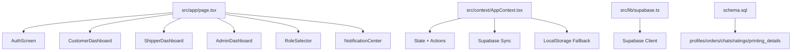
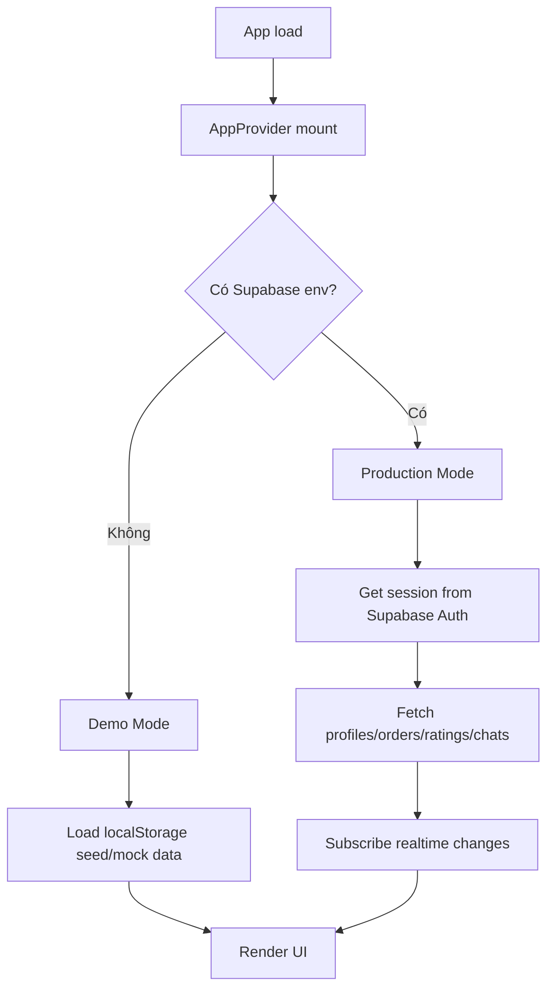

# 🧭 BẢN THIẾT KẾ VẬN HÀNH & BẢO TRÌ APP BK SHIP

Tài liệu này mô tả **app đang chạy như thế nào**, **mỗi module làm gì**, **luồng dữ liệu đi đâu**, và **nên sửa chỗ nào khi phát sinh bug**. Mục tiêu là để bạn dùng như một sổ tay kỹ sư: nhìn vào là biết hệ thống đang ở trạng thái nào, phần nào là nguồn sự thật, phần nào chỉ là demo.

---

## 1) Tổng quan hệ thống

**BK Ship** là ứng dụng giao nhận nội khu cho sinh viên, được xây trên **Next.js 14 + React + TypeScript + TailwindCSS**. App có 3 vai trò chính:

- **Khách hàng**: tạo đơn đồ ăn / đồ uống / in ấn
- **Shipper**: nhận đơn, giao đơn, cập nhật trạng thái
- **Admin**: quản lý đơn và tài khoản

Hệ thống có 2 chế độ vận hành:

- **Demo Mode**: không có Supabase, dữ liệu lưu bằng `localStorage`
- **Production Mode**: có Supabase, dữ liệu đồng bộ database + realtime

> Điểm quan trọng: file `src/lib/telegram.ts` hiện chỉ còn `// Telegram integration removed`, tức là Telegram **không còn chạy trong code hiện tại** dù README cũ vẫn còn mô tả.

---

## 2) Kiến trúc thư mục chính

### Vai trò từng phần

- `src/app/layout.tsx`: bọc app bằng `AppProvider`, set font, metadata, nền chung
- `src/app/page.tsx`: điều phối màn hình theo `user.role`
- `src/context/AppContext.tsx`: **trái tim của app**, chứa state, business logic, đồng bộ dữ liệu
- `src/components/*`: từng màn hình / widget riêng
- `src/lib/supabase.ts`: khởi tạo Supabase client an toàn theo env
- `schema.sql`: schema database + RLS + trigger

---

## 3) Luồng khởi động của app

### Chi tiết

1. `RootLayout` bọc toàn bộ app bằng `AppProvider`
2. `AppContext` quyết định mode dựa trên `isSupabaseConfigured`
3. Nếu **Demo Mode**:
   - load user từ `localStorage`

  Tài liệu này mô tả cách vận hành, roadmap kỹ thuật và hướng phát triển sản phẩm cho BK Ship — một ứng dụng giao nhận nội khu dành cho sinh viên.

  Mục tiêu tài liệu:
  - Là sổ tay cho kỹ sư: mô tả nguồn sự thật (AppContext), những phần demo/giả lập, các luồng chính và checklist vận hành.
  - Đặt lộ trình ưu tiên để chuyển MVP demo sang sản phẩm có thể vận hành lâu dài.

  ---

  ## Tóm tắt nhanh

  - Công nghệ: Next.js 14 (App Router), React, TypeScript, TailwindCSS.
  - Backend (optional): Supabase (Postgres + Realtime). Demo mode dùng `localStorage`.
  - Vai trò: `khach_hang`, `shipper`, `quan_tri`.
  - Trọng tâm hiện tại: ổn định lõi (flow đơn), chuẩn hóa dữ liệu (schema + RLS), theo dõi (activity_logs, order_status_history), và nâng UX (timeline, chat polish).

  ---

  ## Roadmap kỹ thuật (4 lớp)

  1) Ổn định lõi (Hoàn thành):
  - Chuẩn hóa luồng: tạo đơn → nhận → giao → hoàn thành.
  - Tách rõ Demo Mode vs Production Mode.
  - Tập trung tính đúng của giá: `item_cost`, `shipping_fee`, `total_amount`.

  2) Chuẩn hóa dữ liệu (Hoàn thành/Đang làm):
  - Bổ sung schema Supabase, trigger, RLS, migration script (`schema.sql`).
  - Sao lưu hoạt động quan trọng: `activity_logs` và `order_status_history`.

  3) Tăng độ tin cậy (Hoàn thành/Đang làm):
  - Quản lý quyền: chặn switch admin giả, verify admin bằng email domain.
  - Dispute & support: cơ chế admin khôi phục/hủy, log đầy đủ để audit.

  4) Hoàn thiện trải nghiệm (Đang triển khai):
  - Mobile-first UI, timeline trạng thái (đã thêm `OrderStatusTimeline`), chat hiển thị trạng thái, empty/loading states, onboarding tối giản.

  ---

  ## Quy ước code & kiến trúc nhỏ

  - `src/context/AppContext.tsx` là nguồn sự thật runtime — giữ ở mức mỏng nhất có thể; nghiệp vụ quan trọng có thể tách dần thành `services/`.
  - UI chỉ gọi action (không chỉnh state trực tiếp).
  - Khi Supabase không cấu hình, app tự động sử dụng localStorage (dễ demo/QA).
  - Các magic string (storage keys, status values) nằm ở `AppContext` để tránh drift.

  ---

  ## Hướng sản phẩm: làm thế nào để thu hút và giữ người dùng

  Nguyên tắc: giải quyết nỗi đau cốt lõi — tiết kiệm thời gian & tạo sự tin tưởng trong giao dịch COD.

  Các ưu tiên sản phẩm:
  1. Onboarding & First-order flow (1-click): giảm friction, lưu địa chỉ/SDT mặc định, nút reorder.
  2. Thanh toán: COD + in-app wallet (top-up nhanh) để giảm rủi ro và tăng tỷ lệ hoàn thành.
  3. Trust: verify email campus, rating 2 chiều, dispute flow, admin recovery.
  4. Visibility: timeline + chat + map + ETA để giảm lo lắng người dùng.
  5. Growth: referral + promo cho lần đầu + gamification cho shipper.

  ---

  ## MVP Launch checklist (kỹ thuật & vận hành)

  - [ ] First-order UX tối giản: form ngắn, mặc định thông tin, preview tổng tiền trước khi post.
  - [ ] Logging & instrumentation: event = signup, first_order, order_submitted, order_completed, dispute. (Mixpanel/GA/Logs)
  - [ ] Trust rules: verify campus email, ban/appeal UI, admin audit view.
  - [ ] Operational: in-app support report, simple SLA (1h phản hồi cho dispute), monitoring alerts cho spike lỗi.
  - [ ] Growth baseline: referral campaign + 1 mã giảm giá cho lần đầu.

  ---

  ## Các đề xuất nhanh để triển khai (1–2 tuần)

  1) 48–72h: 1‑click reorder + first-order popup (discount) + track event first_order_sent.
  2) 1 tuần: referral credit + small wallet top-up flow (demo payment UI).
  3) 1 tuần song song: verify campus email & admin badge rules.
  4) 2 tuần: instrument dashboard (DAU, conversion, completion rate) và A/B test promo.

  ---

  ## KPIs đề xuất

  - Conversion (session → order) — mục tiêu 8–12% cho lần pilot.
  - Order completion rate — mục tiêu ≥ 95%.
  - Repeat order (7d) — mục tiêu ≥ 15%.
  - Viral coefficient (referral) — > 0.3 để scale.

  ---

  ## Tiếp theo (hành động đề xuất ngay bây giờ)

  1. Ghi rõ 3 user personas và 2 core journeys (mình làm nhanh nếu bạn OK).
  2. Triển khai 1‑click reorder + tracking event (mình có thể code luôn trong repo).
  3. Thiết lập event collection (Mixpanel/GA) small dashboard.

  Nếu OK, chọn 1 hành động để mình bắt tay: `persona`, `reorder`, hoặc `metrics` — mình sẽ cập nhật todo list và tiến hành.

- `fetchFromSupabase()` tải lại toàn bộ dữ liệu chính
- realtime channel lắng nghe thay đổi từ 4 bảng
- mỗi thay đổi sẽ gọi lại `fetchFromSupabase()` để UI đồng nhất

### Khi không có Supabase

- mọi thứ lưu trong `localStorage`
- các key chính:
  - `campus_delivery_user`
  - `campus_delivery_users`
  - `campus_delivery_orders`
  - `campus_delivery_ratings`
  - `campus_delivery_chats`

### Ý nghĩa cho debug

Nếu thấy dữ liệu “mất sau refresh”, kiểm tra:

1. Supabase env có đang set không
2. localStorage key có bị ghi đè không
3. `fetchFromSupabase()` có bị lỗi query không

---

## 10) Luồng tiền và reputation

### Ví / balance

- user mới demo được seed balance sẵn
- `deposit()` cộng tiền vào user hiện tại
- shipper nhận tiền ship khi đơn hoàn thành
- khách hàng bị trừ tổng tiền khi COD được xác nhận

### Reputation

- đánh giá 4–5 sao: cộng reputation
- 3 sao: giữ nguyên
- 1–2 sao: trừ reputation
- shipper hoàn thành đơn: +5 reputation
- shipper hủy đơn: -15 reputation

### Lưu ý

Logic balance/reputation hiện là nghiệp vụ mô phỏng phù hợp demo MVP. Nếu triển khai thật, nên tách ra service riêng để tránh side effect chéo giữa orders/profiles.

---

## 11) Những chỗ dễ phát sinh bug

### 11.1 Sai mode Demo / Production

- kiểm tra `NEXT_PUBLIC_SUPABASE_URL`
- kiểm tra `NEXT_PUBLIC_SUPABASE_ANON_KEY`
- `src/lib/supabase.ts` sẽ trả `null` nếu env chưa đúng

### 11.2 Dữ liệu local không đồng bộ

- xem `saveState()` và `saveChats()` trong context
- kiểm tra `localStorage` trong browser

### 11.3 Đơn in ấn tính sai giá

- kiểm tra `CustomerDashboard` chỗ tính `itemCost`
- kiểm tra `createOrder()` có nhận `printing` không

### 11.4 Chat không hiện

- check `order.id` của đơn
- check `chats` đã load từ Supabase/localStorage chưa

### 11.5 Map không chạy animation

- đơn phải ở `dang_giao`
- nếu `hoan_thanh` thì shipper sẽ đứng ở đích

### 11.6 Admin khóa user nhưng vẫn còn phiên

- nếu khóa đúng user đang login, `logout()` phải được gọi
- kiểm tra nhánh `toggleBanUser()`

---

## 12) Mục tiêu bảo trì nhanh cho kỹ sư

Khi cần sửa app, nên đi theo thứ tự này:

1. **Xác định bug thuộc layer nào**
   - UI component
   - context/business logic
   - Supabase schema
   - localStorage fallback
2. **Tìm action tương ứng trong `AppContext.tsx`**
3. **Xem component nào đang gọi action đó**
4. **Kiểm tra cả Demo Mode và Production Mode**
5. **Nếu đổi schema thì cập nhật luôn `schema.sql` và tài liệu này**

---

## 13) Bản đồ sửa lỗi theo file

| File | Vai trò | Khi nào mở |
| --- | --- | --- |
| `src/context/AppContext.tsx` | state + business rules | lỗi luồng đơn, ví, login, rating, chat |
| `src/app/page.tsx` | điều phối màn hình | lỗi render sai dashboard |
| `src/components/CustomerDashboard.tsx` | tạo đơn + theo dõi | lỗi đặt đơn, upload PDF, promo |
| `src/components/ShipperDashboard.tsx` | nhận/giao đơn | lỗi status, COD, reputation |
| `src/components/AdminDashboard.tsx` | quản trị | lỗi khóa user, hủy đơn |
| `src/components/ChatBox.tsx` | chat | lỗi nhắn tin |
| `src/components/CampusMap.tsx` | bản đồ mô phỏng | lỗi routing/animation |
| `src/lib/supabase.ts` | cấu hình backend | lỗi env, mất kết nối DB |
| `schema.sql` | database | lỗi bảng, trigger, RLS |

---

## 14) Ghi chú trạng thái hiện tại của repo

- App đã có **MVP đầy đủ 3 vai trò**
- Có **fallback chạy offline** bằng localStorage
- Có **Supabase integration** cho production
- Có **chat + map + wallet + rating** trong code hiện tại
- **Telegram đã bị gỡ khỏi implementation thật** dù tài liệu cũ còn nhắc tới

---

## 15) Kết luận vận hành

Nếu nhìn theo kiểu kỹ sư, app này đang là:

- **1 frontend Next.js** làm toàn bộ UI
- **1 context state center** điều khiển nghiệp vụ
- **1 backend Supabase tùy chọn** để đồng bộ production
- **1 local demo layer** để trình diễn khi chưa có DB

Nói ngắn gọn: **UI mượt, luồng nghiệp vụ rõ, demo được ngay, và có đường nâng cấp lên production**.

> Nếu bạn muốn, bước tiếp theo mình có thể viết tiếp cho bạn một file thứ 2 kiểu **“Hướng dẫn sửa lỗi / checklist debug”** hoặc **“Sơ đồ module & API nội bộ”** để quản lý dự án còn tiện hơn nữa.

---

## 16) Phương án xây dựng app tiến tới hoàn chỉnh

Mục tiêu của giai đoạn tiếp theo không phải thêm thật nhiều tính năng, mà là **đưa app từ MVP demo thành sản phẩm vận hành được lâu dài**. Cách làm hợp lý nhất là đi theo 4 lớp: **ổn định lõi → chuẩn hóa dữ liệu → tăng độ tin cậy → hoàn thiện trải nghiệm**.

### Giai đoạn 1: Cố định lõi nghiệp vụ

Ưu tiên làm sạch những phần đang ảnh hưởng trực tiếp tới hành vi người dùng:

- chuẩn hóa luồng đăng nhập / đăng xuất
- khóa chặt luồng tạo đơn → nhận đơn → giao đơn → hoàn thành
- tách rõ logic Demo Mode và Production Mode
- thống nhất cách tính `item_cost`, `shipping_fee`, `total_amount`
- đảm bảo các trạng thái đơn không bị nhảy sai

**Đầu ra mong muốn:** app chạy ổn, không mất dữ liệu trong flow chính, mọi vai trò thao tác đúng trách nhiệm.

### Giai đoạn 2: Hoàn thiện backend thật

Khi lõi đã ổn, chuyển sang chuẩn hóa dữ liệu và đồng bộ:

- hoàn thiện Supabase schema cho production
- bổ sung trigger/policy/RLS đủ chặt
- tách business logic quan trọng sang server/action riêng nếu cần
- chuẩn hóa cách đồng bộ realtime
- viết migration rõ ràng cho database

**Đầu ra mong muốn:** production mode đáng tin cậy, không còn phụ thuộc cảm tính vào localStorage.

### Giai đoạn 3: Hoàn thiện nghiệp vụ vận hành

Đây là lớp giúp app dùng được như một hệ thống thực tế:

- quản lý ví theo giao dịch rõ ràng hơn
- ghi log sự kiện quan trọng: tạo đơn, nhận đơn, hủy đơn, hoàn thành
- bổ sung lịch sử giao dịch / lịch sử thay đổi trạng thái
- quản lý quyền theo role rõ hơn thay vì chỉ đổi giao diện
- chuẩn hóa thông báo và cảnh báo lỗi

**Đầu ra mong muốn:** khi có sự cố, bạn truy ngược được ai làm gì, lúc nào, ở đâu.

### Giai đoạn 4: Nâng cấp trải nghiệm người dùng

Sau khi hệ thống đã vững, mới tối ưu bề mặt sản phẩm:

- tối ưu mobile UX
- cải thiện màn hình tạo đơn
- làm rõ trạng thái đơn bằng timeline hoặc progress bar
- làm chat và map mượt hơn
- bổ sung empty states, loading states, error states
- nếu cần, thêm dark mode và dashboard phân tích

**Đã triển khai trong code hiện tại:**

- timeline trạng thái đơn hàng dùng chung giữa khách hàng và shipper
- hiển thị trạng thái đơn ngay trong khung chat
- cải thiện empty-state wording để bớt “trống rỗng công nghiệp”

**Đầu ra mong muốn:** app không chỉ chạy được, mà còn nhìn “ra sản phẩm”.

### Thứ tự triển khai khuyến nghị

Nếu làm thực tế, nên đi theo đúng thứ tự này:

1. **Chuẩn hóa AppContext và flow đơn hàng**
2. **Chuẩn hóa schema Supabase và quyền dữ liệu**
3. **Đóng gói chat / map / wallet thành module rõ ràng hơn**
4. **Bổ sung logging, theo dõi lỗi, lịch sử giao dịch**
5. **Tinh chỉnh UI/UX và các chi tiết hoàn thiện cuối**

### Tiêu chí để biết app đã “gần hoàn chỉnh”

App có thể coi là gần hoàn chỉnh khi đạt đủ các điều kiện sau:

- người dùng đăng nhập ổn định
- tạo đơn không lỗi
- shipper nhận/giao đơn không lệch trạng thái
- admin quản lý được user và đơn
- dữ liệu không mất khi refresh
- production mode chạy được mà không phụ thuộc demo
- có thể debug theo log hoặc lịch sử thay đổi

### Kết luận chiến lược

**Đừng mở rộng tính năng trước khi khóa vững lõi.**

Với app kiểu này, cách đi đúng là:

> **đóng flow chính trước → chuẩn hóa dữ liệu sau → tăng tin cậy hệ thống → rồi mới làm đẹp và thêm tính năng phụ**

Nếu bạn muốn, mình có thể viết tiếp cho bạn một file riêng tên kiểu:

- `roadmap-ky-thuat.md`: roadmap kỹ thuật theo tuần
- `checklist-debug.md`: checklist sửa lỗi theo triệu chứng
- `spec-module.md`: mô tả từng module và interface nội bộ
