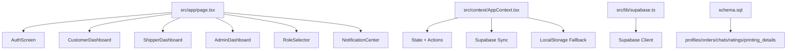
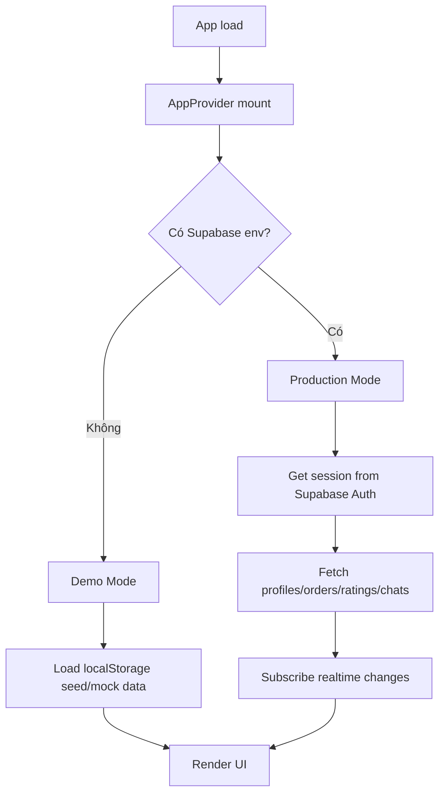
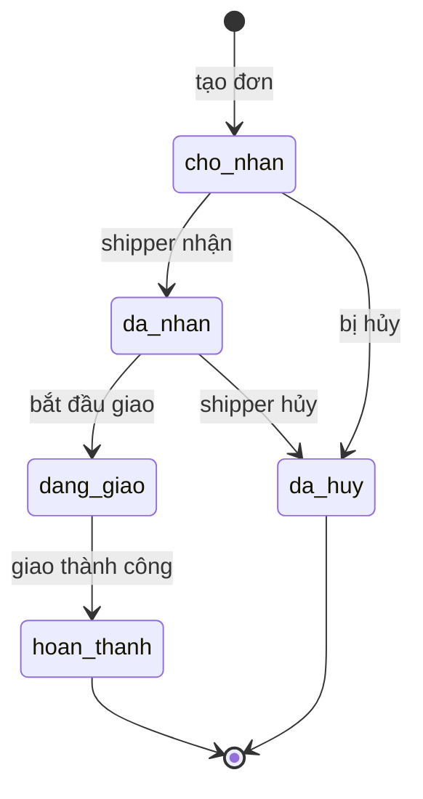
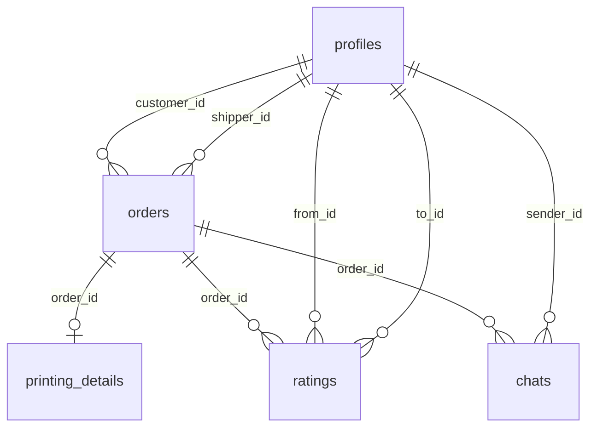

# 🧭 BẢN THIẾT KẾ VẬN HÀNH & BẢO TRÌ APP BK SHIP

Tài liệu này mô tả **app đang chạy như thế nào**, **mỗi module làm gì**, **luồng dữ liệu đi đâu**, và **nên sửa chỗ nào khi phát sinh bug**. Mục tiêu là để bạn dùng như một sổ tay kỹ sư: nhìn vào là biết hệ thống đang ở trạng thái nào, phần nào là nguồn sự thật, phần nào chỉ là demo.

---

## 1) Tổng quan hệ thống

**BK Ship** là ứng dụng giao nhận nội khu cho sinh viên, được xây trên **Next.js 14 + React + TypeScript + TailwindCSS**. App có 3 vai trò chính:

- **Khách hàng**: tạo đơn đồ ăn / đồ uống / in ấn
- **Shipper**: nhận đơn, giao đơn, cập nhật trạng thái
- **Admin**: quản lý đơn và tài khoản

Hệ thống có 2 chế độ vận hành:

- **Demo Mode**: không có Supabase, dữ liệu lưu bằng `localStorage`
- **Production Mode**: có Supabase, dữ liệu đồng bộ database + realtime

> Điểm quan trọng: file `src/lib/telegram.ts` hiện chỉ còn `// Telegram integration removed`, tức là Telegram **không còn chạy trong code hiện tại** dù README cũ vẫn còn mô tả.

---

## 2) Kiến trúc thư mục chính

### Vai trò từng phần

- `src/app/layout.tsx`: bọc app bằng `AppProvider`, set font, metadata, nền chung
- `src/app/page.tsx`: điều phối màn hình theo `user.role`
- `src/context/AppContext.tsx`: **trái tim của app**, chứa state, business logic, đồng bộ dữ liệu
- `src/components/*`: từng màn hình / widget riêng
- `src/lib/supabase.ts`: khởi tạo Supabase client an toàn theo env
- `schema.sql`: schema database + RLS + trigger

---

## 3) Luồng khởi động của app

### Chi tiết

1. `RootLayout` bọc toàn bộ app bằng `AppProvider`
2. `AppContext` quyết định mode dựa trên `isSupabaseConfigured`
3. Nếu **Demo Mode**:
   - load user từ `localStorage`
   - nạp mock users/orders nếu chưa có dữ liệu
   - chat/ratings cũng lưu local
4. Nếu **Production Mode**:
   - gọi `supabase.auth.getSession()`
   - fetch dữ liệu từ các bảng
   - subscribe realtime cho `orders`, `profiles`, `ratings`, `chats`

---

## 4) State trung tâm và trách nhiệm

File quan trọng nhất là `src/context/AppContext.tsx`.

### State chính

- `user`: tài khoản đang đăng nhập
- `users`: danh sách profile
- `orders`: danh sách đơn hàng
- `ratings`: đánh giá
- `notifications`: thông báo UI nội bộ
- `chats`: tin nhắn theo đơn
- `isDemoMode`: cờ phân biệt local/supabase

### Actions chính

- `login(email, fullName?)`
- `logout()`
- `switchRole(role)`
- `createOrder(orderData, printing?)`
- `acceptOrder(orderId)`
- `updateOrderStatus(orderId, status, actualItemCost?)`
- `submitRating(orderId, toId, score, comment)`
- `toggleBanUser(userId)`
- `deposit(amount)`
- `sendChatMessage(orderId, message)`

### Nguyên tắc thiết kế

- **UI không tự sửa dữ liệu trực tiếp**; UI luôn gọi action trong context
- **AppContext là nguồn sự thật cho trạng thái runtime**
- Nếu có Supabase thì state được cập nhật lại từ DB bằng `fetchFromSupabase()`
- Nếu không có Supabase thì state được ghi vào `localStorage`

---

## 5) Mô hình dữ liệu

### Các kiểu chính trong app

- `UserProfile`
- `Order`
- `PrintingDetails`
- `Rating`
- `ChatMessage`

### Trạng thái đơn hàng

### Ý nghĩa từng trạng thái

- `cho_nhan`: đơn đang chờ shipper
- `da_nhan`: đã có shipper nhận
- `dang_giao`: đang giao thực tế
- `hoan_thanh`: đã giao xong
- `da_huy`: bị hủy

---

## 6) Luồng nghiệp vụ theo vai trò

### 6.1 Khách hàng

Màn hình chính: `src/components/CustomerDashboard.tsx`

Chức năng:

- xem ví `CampusWallet`
- xem lịch sử đơn
- tạo đơn mới
- upload file PDF cho đơn in ấn
- áp mã giảm giá
- xem map đơn đang giao
- chat với shipper
- đánh giá shipper sau khi hoàn thành

#### Luồng tạo đơn

1. nhập title, mô tả, vị trí, số điện thoại, phí ship
2. chọn loại đơn: đồ ăn / đồ uống / in ấn
3. nếu là in ấn:
   - upload PDF
   - chọn số bản
   - chọn màu / đen trắng
   - chọn 1 mặt / 2 mặt
4. bấm tạo đơn
5. `createOrder()` tính `total_amount`
6. đơn xuất hiện ở tab theo dõi và bảng tin shipper

#### Điểm cần nhớ khi debug

- Chi phí in đang là **mock logic**: `10 trang x số bản x đơn giá`
- `promoCode` chỉ là logic frontend, chưa phải module voucher thật
- `CampusWallet` là ví mô phỏng, không phải payment gateway

---

### 6.2 Shipper

Màn hình chính: `src/components/ShipperDashboard.tsx`

Chức năng:

- xem stats cá nhân
- xem bảng tin đơn chờ nhận
- nhận đơn
- xem đơn đang nhận
- đổi trạng thái đơn
- nhập tiền hàng thực tế khi giao xong
- mở map / chat theo đơn

#### Luồng giao đơn

1. shipper xem tab `pool`
2. bấm nhận đơn → `acceptOrder(orderId)`
3. đơn chuyển sang `da_nhan`
4. bấm “Bắt đầu đi giao” → `updateOrderStatus(..., 'dang_giao')`
5. bấm “Đã giao hàng thành công”
6. nhập hóa đơn thực tế
7. `updateOrderStatus(..., 'hoan_thanh', actualCost)`
8. hệ thống cộng/trừ ví, cập nhật uy tín

#### Điểm nghiệp vụ quan trọng

- shipper bị khóa không được nhận đơn
- cancel đơn sau khi nhận sẽ bị trừ uy tín
- hoàn thành đơn sẽ tăng reputation
- top shipper là người có `orders_completed >= 5`

---

### 6.3 Admin

Màn hình chính: `src/components/AdminDashboard.tsx`

Chức năng:

- xem tổng số đơn / user / tỷ lệ hoàn thành / doanh thu ship
- tìm kiếm đơn và user
- hủy đơn spam hoặc đơn lỗi
- khóa / mở khóa user

#### Lưu ý kỹ thuật

- phần chọn role trong bảng admin hiện chỉ là **gợi ý UI**, chưa phải cơ chế phân quyền thật ngoài DB
- thao tác khóa user gọi `toggleBanUser(userId)`
- thao tác hủy đơn gọi `updateOrderStatus(orderId, 'da_huy')`

---

## 7) Các widget hỗ trợ

### `RoleSelector`

File: `src/components/RoleSelector.tsx`

- thanh nổi ở đáy màn hình
- cho phép đổi nhanh 3 vai trò
- phục vụ demo và test flow nhanh

> Đây là công cụ mô phỏng role switching, nên khi sửa bug liên quan quyền truy cập, cần nhớ rằng đây không phải auth thật.

### `NotificationCenter`

File: `src/components/NotificationCenter.tsx`

- hiển thị notification nội bộ từ context
- có badge đếm số thông báo
- dùng cho các event như: login, create order, accept order, complete order, ban user

### `ChatBox`

File: `src/components/ChatBox.tsx`

- chat theo từng đơn (`order_id`)
- có quick replies cho cả khách và shipper
- scroll xuống cuối khi có tin nhắn mới

### `CampusWalletCard`

File: `src/components/CampusWalletCard.tsx`

- hiển thị số dư hiện tại
- nút nạp tiền demo
- cập nhật balance qua `deposit(amount)`

### `CampusMap`

File: `src/components/CampusMap.tsx`

- bản đồ SVG mô phỏng HUST
- dùng cho 2 chế độ:
  - chọn vị trí giao hàng
  - theo dõi lộ trình đơn đang giao
- có zoom, pan, route animation, marker địa danh

---

## 8) Mô hình dữ liệu Supabase

File: `schema.sql`

### Bảng chính

- `profiles`
- `orders`
- `printing_details`
- `ratings`
- `chats`

### Trigger / policy chính

- tạo profile tự động khi có `auth.users`
- tăng `orders_completed` và `reputation` khi đơn hoàn thành
- RLS bật cho toàn bộ bảng

### Quan hệ dữ liệu

---

## 9) Cơ chế đồng bộ dữ liệu

### Khi có Supabase

- `fetchFromSupabase()` tải lại toàn bộ dữ liệu chính
- realtime channel lắng nghe thay đổi từ 4 bảng
- mỗi thay đổi sẽ gọi lại `fetchFromSupabase()` để UI đồng nhất

### Khi không có Supabase

- mọi thứ lưu trong `localStorage`
- các key chính:
  - `campus_delivery_user`
  - `campus_delivery_users`
  - `campus_delivery_orders`
  - `campus_delivery_ratings`
  - `campus_delivery_chats`

### Ý nghĩa cho debug

Nếu thấy dữ liệu “mất sau refresh”, kiểm tra:

1. Supabase env có đang set không
2. localStorage key có bị ghi đè không
3. `fetchFromSupabase()` có bị lỗi query không

---

## 10) Luồng tiền và reputation

### Ví / balance

- user mới demo được seed balance sẵn
- `deposit()` cộng tiền vào user hiện tại
- shipper nhận tiền ship khi đơn hoàn thành
- khách hàng bị trừ tổng tiền khi COD được xác nhận

### Reputation

- đánh giá 4–5 sao: cộng reputation
- 3 sao: giữ nguyên
- 1–2 sao: trừ reputation
- shipper hoàn thành đơn: +5 reputation
- shipper hủy đơn: -15 reputation

### Lưu ý

Logic balance/reputation hiện là nghiệp vụ mô phỏng phù hợp demo MVP. Nếu triển khai thật, nên tách ra service riêng để tránh side effect chéo giữa orders/profiles.

---

## 11) Những chỗ dễ phát sinh bug

### 11.1 Sai mode Demo / Production

- kiểm tra `NEXT_PUBLIC_SUPABASE_URL`
- kiểm tra `NEXT_PUBLIC_SUPABASE_ANON_KEY`
- `src/lib/supabase.ts` sẽ trả `null` nếu env chưa đúng

### 11.2 Dữ liệu local không đồng bộ

- xem `saveState()` và `saveChats()` trong context
- kiểm tra `localStorage` trong browser

### 11.3 Đơn in ấn tính sai giá

- kiểm tra `CustomerDashboard` chỗ tính `itemCost`
- kiểm tra `createOrder()` có nhận `printing` không

### 11.4 Chat không hiện

- check `order.id` của đơn
- check `chats` đã load từ Supabase/localStorage chưa

### 11.5 Map không chạy animation

- đơn phải ở `dang_giao`
- nếu `hoan_thanh` thì shipper sẽ đứng ở đích

### 11.6 Admin khóa user nhưng vẫn còn phiên

- nếu khóa đúng user đang login, `logout()` phải được gọi
- kiểm tra nhánh `toggleBanUser()`

---

## 12) Mục tiêu bảo trì nhanh cho kỹ sư

Khi cần sửa app, nên đi theo thứ tự này:

1. **Xác định bug thuộc layer nào**
   - UI component
   - context/business logic
   - Supabase schema
   - localStorage fallback
2. **Tìm action tương ứng trong `AppContext.tsx`**
3. **Xem component nào đang gọi action đó**
4. **Kiểm tra cả Demo Mode và Production Mode**
5. **Nếu đổi schema thì cập nhật luôn `schema.sql` và tài liệu này**

---

## 13) Bản đồ sửa lỗi theo file

| File | Vai trò | Khi nào mở |
| --- | --- | --- |
| `src/context/AppContext.tsx` | state + business rules | lỗi luồng đơn, ví, login, rating, chat |
| `src/app/page.tsx` | điều phối màn hình | lỗi render sai dashboard |
| `src/components/CustomerDashboard.tsx` | tạo đơn + theo dõi | lỗi đặt đơn, upload PDF, promo |
| `src/components/ShipperDashboard.tsx` | nhận/giao đơn | lỗi status, COD, reputation |
| `src/components/AdminDashboard.tsx` | quản trị | lỗi khóa user, hủy đơn |
| `src/components/ChatBox.tsx` | chat | lỗi nhắn tin |
| `src/components/CampusMap.tsx` | bản đồ mô phỏng | lỗi routing/animation |
| `src/lib/supabase.ts` | cấu hình backend | lỗi env, mất kết nối DB |
| `schema.sql` | database | lỗi bảng, trigger, RLS |

---

## 14) Ghi chú trạng thái hiện tại của repo

- App đã có **MVP đầy đủ 3 vai trò**
- Có **fallback chạy offline** bằng localStorage
- Có **Supabase integration** cho production
- Có **chat + map + wallet + rating** trong code hiện tại
- **Telegram đã bị gỡ khỏi implementation thật** dù tài liệu cũ còn nhắc tới

---

## 15) Kết luận vận hành

Nếu nhìn theo kiểu kỹ sư, app này đang là:

- **1 frontend Next.js** làm toàn bộ UI
- **1 context state center** điều khiển nghiệp vụ
- **1 backend Supabase tùy chọn** để đồng bộ production
- **1 local demo layer** để trình diễn khi chưa có DB

Nói ngắn gọn: **UI mượt, luồng nghiệp vụ rõ, demo được ngay, và có đường nâng cấp lên production**.

> Nếu bạn muốn, bước tiếp theo mình có thể viết tiếp cho bạn một file thứ 2 kiểu **“Hướng dẫn sửa lỗi / checklist debug”** hoặc **“Sơ đồ module & API nội bộ”** để quản lý dự án còn tiện hơn nữa.

---

## 16) Phương án xây dựng app tiến tới hoàn chỉnh

Mục tiêu của giai đoạn tiếp theo không phải thêm thật nhiều tính năng, mà là **đưa app từ MVP demo thành sản phẩm vận hành được lâu dài**. Cách làm hợp lý nhất là đi theo 4 lớp: **ổn định lõi → chuẩn hóa dữ liệu → tăng độ tin cậy → hoàn thiện trải nghiệm**.

### Giai đoạn 1: Cố định lõi nghiệp vụ

Ưu tiên làm sạch những phần đang ảnh hưởng trực tiếp tới hành vi người dùng:

- chuẩn hóa luồng đăng nhập / đăng xuất
- khóa chặt luồng tạo đơn → nhận đơn → giao đơn → hoàn thành
- tách rõ logic Demo Mode và Production Mode
- thống nhất cách tính `item_cost`, `shipping_fee`, `total_amount`
- đảm bảo các trạng thái đơn không bị nhảy sai

**Đầu ra mong muốn:** app chạy ổn, không mất dữ liệu trong flow chính, mọi vai trò thao tác đúng trách nhiệm.

### Giai đoạn 2: Hoàn thiện backend thật

Khi lõi đã ổn, chuyển sang chuẩn hóa dữ liệu và đồng bộ:

- hoàn thiện Supabase schema cho production
- bổ sung trigger/policy/RLS đủ chặt
- tách business logic quan trọng sang server/action riêng nếu cần
- chuẩn hóa cách đồng bộ realtime
- viết migration rõ ràng cho database

**Đầu ra mong muốn:** production mode đáng tin cậy, không còn phụ thuộc cảm tính vào localStorage.

### Giai đoạn 3: Hoàn thiện nghiệp vụ vận hành

Đây là lớp giúp app dùng được như một hệ thống thực tế:

- quản lý ví theo giao dịch rõ ràng hơn
- ghi log sự kiện quan trọng: tạo đơn, nhận đơn, hủy đơn, hoàn thành
- bổ sung lịch sử giao dịch / lịch sử thay đổi trạng thái
- quản lý quyền theo role rõ hơn thay vì chỉ đổi giao diện
- chuẩn hóa thông báo và cảnh báo lỗi

**Đầu ra mong muốn:** khi có sự cố, bạn truy ngược được ai làm gì, lúc nào, ở đâu.

### Giai đoạn 4: Nâng cấp trải nghiệm người dùng

Sau khi hệ thống đã vững, mới tối ưu bề mặt sản phẩm:

- tối ưu mobile UX
- cải thiện màn hình tạo đơn
- làm rõ trạng thái đơn bằng timeline hoặc progress bar
- làm chat và map mượt hơn
- bổ sung empty states, loading states, error states
- nếu cần, thêm dark mode và dashboard phân tích

**Đã triển khai trong code hiện tại:**

- timeline trạng thái đơn hàng dùng chung giữa khách hàng và shipper
- hiển thị trạng thái đơn ngay trong khung chat
- cải thiện empty-state wording để bớt “trống rỗng công nghiệp”

**Đầu ra mong muốn:** app không chỉ chạy được, mà còn nhìn “ra sản phẩm”.

### Thứ tự triển khai khuyến nghị

Nếu làm thực tế, nên đi theo đúng thứ tự này:

1. **Chuẩn hóa AppContext và flow đơn hàng**
2. **Chuẩn hóa schema Supabase và quyền dữ liệu**
3. **Đóng gói chat / map / wallet thành module rõ ràng hơn**
4. **Bổ sung logging, theo dõi lỗi, lịch sử giao dịch**
5. **Tinh chỉnh UI/UX và các chi tiết hoàn thiện cuối**

### Tiêu chí để biết app đã “gần hoàn chỉnh”

App có thể coi là gần hoàn chỉnh khi đạt đủ các điều kiện sau:

- người dùng đăng nhập ổn định
- tạo đơn không lỗi
- shipper nhận/giao đơn không lệch trạng thái
- admin quản lý được user và đơn
- dữ liệu không mất khi refresh
- production mode chạy được mà không phụ thuộc demo
- có thể debug theo log hoặc lịch sử thay đổi

### Kết luận chiến lược

**Đừng mở rộng tính năng trước khi khóa vững lõi.**

Với app kiểu này, cách đi đúng là:

> **đóng flow chính trước → chuẩn hóa dữ liệu sau → tăng tin cậy hệ thống → rồi mới làm đẹp và thêm tính năng phụ**

Nếu bạn muốn, mình có thể viết tiếp cho bạn một file riêng tên kiểu:

- `roadmap-ky-thuat.md`: roadmap kỹ thuật theo tuần
- `checklist-debug.md`: checklist sửa lỗi theo triệu chứng
- `spec-module.md`: mô tả từng module và interface nội bộ
